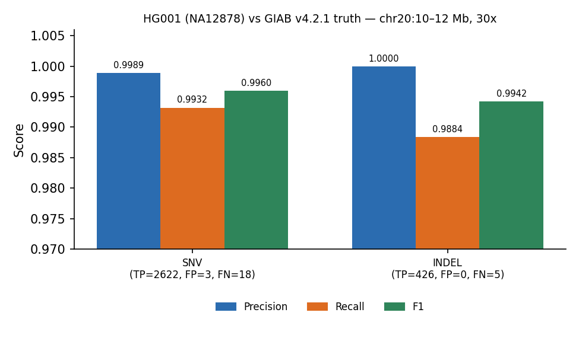

# germline-variant-calling-nf

[](https://github.com/Swetcha2001/germline-variant-calling-nf/actions/workflows/ci.yml)


A reproducible **Nextflow DSL2** pipeline for short-read **germline SNV/indel calling** that follows GATK best practices, from raw FASTQ to an annotated, clinically cross-referenced VCF. It is **benchmarked against the Genome in a Bottle (GIAB) HG001 / NA12878 truth set**.

```
FASTQ ─► FastQC ─► fastp ─► BWA-MEM ─► MarkDuplicates ─► [BQSR] ─► HaplotypeCaller
                                           │                              │
                                   samtools stats              GATK hard filters (SNP / indel)
                                                                          │
                                   bcftools csq (Ensembl) ◄───────────────┤
                                   ClinVar CLNSIG lookup                  │
                                   variant table + summary       GIAB benchmark (precision / recall / F1)
                                                                          │
                                                  MultiQC report ◄────────┘
```

## Benchmark results

HG001 (NA12878), GIAB 30x Illumina HiSeq, **chr20:10–12 Mb** (~220k read pairs, 1.96 Mb of GIAB high-confidence sequence), GRCh37, compared against **GIAB v4.2.1** truth:

| Type  | TP    | FP | FN | Precision | Recall | F1         |
|-------|------:|---:|---:|----------:|-------:|-----------:|
| SNV   | 2,622 | 3  | 18 | 0.9989    | 0.9932 | **0.9960** |
| Indel | 426   | 0  | 5  | 1.0000    | 0.9884 | **0.9942** |



Other QC for the benchmark run: mean depth ~32x, 99.98% of reads properly paired, 0.06% duplication, Ti/Tv = 2.17. That Ti/Tv matches the ~2.0–2.1 expected for whole-genome germline calls.

*Matching is allele-exact after splitting multiallelic sites and left-normalising both files (`bcftools norm`), inside GIAB high-confidence regions. Representation-aware tools (hap.py / vcfeval) can rescue a few more complex indels, so these numbers are conservative.*

Full outputs: [`docs/results/`](docs/results/)

## Features

- **Nextflow DSL2**, with one module per step and resumable runs (`-resume`)
- **Read QC and trimming:** FastQC, fastp (adapter auto-detection, quality and length filters)
- **Alignment:** BWA-MEM with read groups, coordinate sorting, duplicate marking (GATK MarkDuplicates)
- **Optional BQSR** when `--known_sites` (dbSNP/Mills) is supplied
- **Variant calling:** GATK HaplotypeCaller, then GATK-recommended **hard filters** tuned separately for SNPs and indels
- **Annotation:** `bcftools csq` functional consequences (missense, frameshift, splice…) from Ensembl gene models, plus a **ClinVar** lookup (CLNSIG, condition, review status)
- **Clinical-style summary:** per-sample variant table (gene, consequence, protein change, ClinVar), plus a Markdown report that lists pathogenic / likely pathogenic hits
- **Benchmarking** against any GIAB truth VCF + BED (SNV and indel precision / recall / F1)
- **Reproducibility:** pinned `environment.yml`, Dockerfile, conda / mamba / docker / singularity profiles, and execution report, timeline and DAG
- **CI:** GitHub Actions runs the full pipeline on a GIAB subset on every push and fails if F1 drops below 0.95

## Quick start

```bash
git clone https://github.com/Swetcha2001/germline-variant-calling-nf.git
cd germline-variant-calling-nf

# 1. tools (or use -profile docker after: docker build -t germline-vc:1.0.0 .)
mamba env create -f environment.yml && mamba activate germline-vc
mamba install -c bioconda nextflow

# 2. reference data: GRCh37 chr20, Ensembl GFF3, ClinVar, GIAB HG001 truth (~30 MB)
bash scripts/download_reference.sh

# 3. run the bundled test (22k read pairs, chr20:10.0-10.2 Mb, ~2 min)
export PATH=$PWD/bin:$PATH
nextflow run main.nf -profile test

# 4. reproduce the 2 Mb benchmark above
bash scripts/make_reads.sh 20:10000000-12000000 benchmark_data
nextflow run main.nf -profile benchmark
```

### Your own data

```bash
nextflow run main.nf \
  --input samples.csv \          # sample,fastq_1,fastq_2
  --fasta GRCh38.fa \
  --known_sites dbsnp.vcf.gz \   # optional, enables BQSR
  --gff Homo_sapiens.GRCh38.gff3.gz \
  --clinvar clinvar.vcf.gz \
  --intervals targets.bed \      # optional (exome / panel)
  -profile docker
```

## Outputs

| Path | Contents |
|---|---|
| `qc/fastqc`, `qc/fastp` | Raw-read QC and trimming reports |
| `alignment/` | Duplicate-marked BAM + index, MarkDuplicates metrics |
| `qc/alignment/` | `samtools stats / flagstat / idxstats` |
| `variants/raw/` | HaplotypeCaller VCF |
| `variants/filtered/` | Hard-filtered VCF (FILTER column populated) + `bcftools stats` |
| `variants/annotated/` | PASS variants with `BCSQ` consequences and ClinVar fields |
| `reports/` | `*.variant_table.tsv` and `*.variant_summary.md` |
| `benchmark/` | Precision / recall / F1 vs. truth set |
| `multiqc/` | Aggregated QC report |
| `pipeline_info/` | Nextflow execution report, timeline, trace, DAG |

## Design notes

- **Why hard filters instead of VQSR?** VQSR needs many samples or an exome/genome-wide callset to train its model. For single samples and small regions, GATK recommends hard filtering.
- **Why GRCh37 for the benchmark?** The public GIAB 30x HG001 BAM used to generate the test reads is aligned to b37. Reads are converted back to FASTQ (`scripts/make_reads.sh`), so the pipeline itself starts from raw reads and works with any reference build.
- **Why bcftools csq?** It is fast, runs offline and is haplotype-aware (it calls compound consequences correctly when variants are phased). It needs only a GFF3, not a multi-GB cache.

## Data sources

- Reads: GIAB HG001 NIST HiSeq 300x, downsampled to 30x (`RMNISTHS_30xdownsample.bam`), NCBI GIAB FTP
- Truth: GIAB HG001 v4.2.1 benchmark VCF/BED (GRCh37)
- Reference and gene models: Ensembl GRCh37 release 75 (FASTA) / release 87 (GFF3)
- ClinVar: NCBI ClinVar GRCh37 VCF

## Author

**Swetcha Radandi**, Bioinformatics / Molecular Genetics · [GitHub](https://github.com/Swetcha2001)
